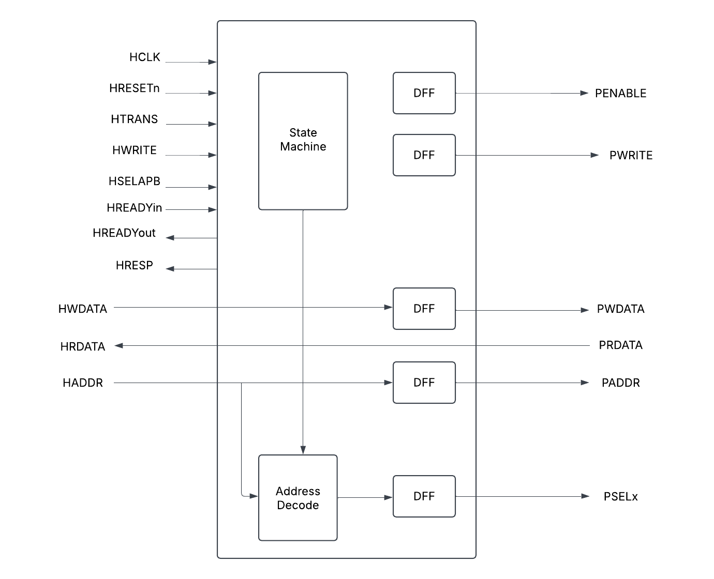
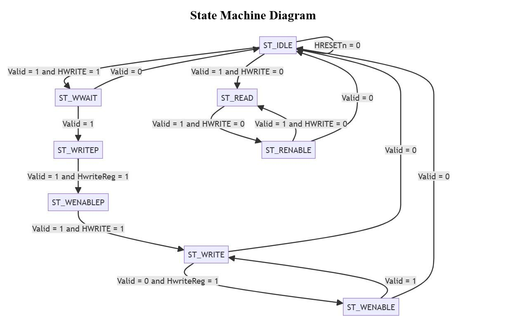
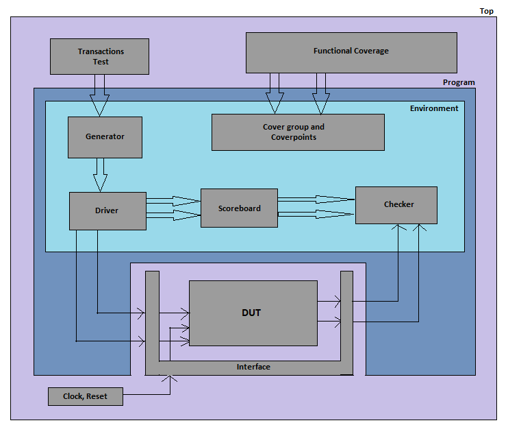
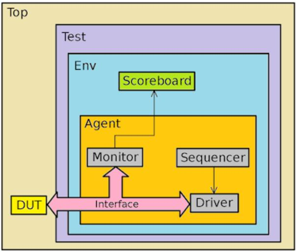
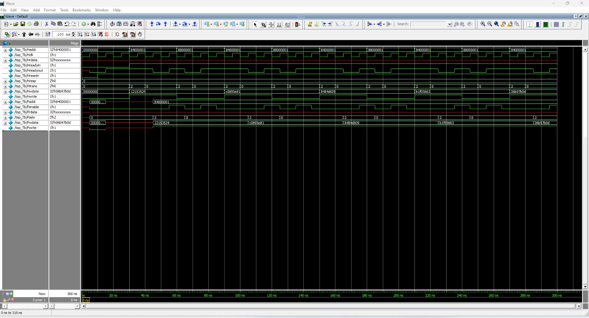

# AHB to APB Bridge — Design & UVM Verification (Team 8)

A synthesizable **AHB-to-APB bridge** RTL design and its layered, class-based and **UVM** verification environment, developed for **ECE 593: Fundamentals of Pre-Silicon Validation** (Winter 2025, Portland State University).

**Team 8:** Bhavana Manikyanahalli Srinivasegowda, Harsha Vardhan Duvvuru, Lokarjun Ramesh

---

## How to Run the UVM Milestone-5 Testbench

Go to the M5/TB/ directory and run:

```
make all
```

This runs the default flow defined in `M5/TB/Makefile`: `clean → compile → run_coverage → report`. It compiles the AHB/APB interfaces, the `bridge_top` DUT, and `tb_top.sv`; runs the simulation while saving coverage to `covfile.ucdb`; and generates the coverage report `ahb_apb_bridge_report.txt`.

---

## Overview

The AHB-to-APB bridge is an **AHB slave** that provides an interface between the high-speed **AHB** (Advanced High-performance Bus) and the low-power **APB** (Advanced Peripheral Bus). Read and write transfers on the AHB are converted into equivalent transfers on the APB. Because the APB is not pipelined, the bridge inserts wait states when the AHB must wait for the APB.

The bridge unit performs the following functions:

- Latches the address and holds it valid throughout the transfer.
- Decodes the address and generates a peripheral select (`PSELx`); only one select is active during a transfer.
- Drives data onto the APB for a write transfer.
- Drives APB data onto the system bus for a read transfer.
- Generates the timing strobe `PENABLE` for the transfer.

### Verification objectives

- Verify correct AHB-to-APB protocol conversion.
- Ensure data integrity across the bridge.
- Validate read and write transactions.
- Ensure APB timing constraints are met.
- Validate throughput and performance.

---

## Top-Level Architecture

The bridge top contains an FSM-based APB controller, an address-decode block, and registered (DFF) outputs for the APB-side signals. The design emphasizes the AHB–APB interface signals; the AHB inputs (`HCLK`, `HRESETn`, `HTRANS`, `HWRITE`, `HSELAPB`, `HREADYin`, `HWDATA`, `HADDR`) are converted into APB outputs (`PENABLE`, `PWRITE`, `PWDATA`, `PADDR`, `PSELx`) with `HRDATA`, `HREADYout`, and `HRESP` returned to the AHB side.


*Fig 1: Top-level block diagram of the AHB-to-APB bridge.*

The actual `bridge_top` module (in `M*/CLASS/bridge_top.sv`) instantiates the AHB slave interface and the APB FSM controller, with these ports:

```
input  logic        Hclk, Hresetn, Hwrite, Hreadyin;
input  logic [31:0] Hwdata, Haddr, Prdata;
input  logic [1:0]  Htrans;
output logic        Penable, Pwrite, Hreadyout;
output logic [1:0]  Hresp;
output logic [2:0]  Pselx;
output logic [31:0] Paddr, Pwdata, Hrdata;
```

### APB FSM Controller

The APB controller is implemented as a finite state machine with eight states:
`ST_IDLE`, `ST_WWAIT`, `ST_READ`, `ST_WRITE`, `ST_WRITEP`, `ST_RENABLE`, `ST_WENABLE`, and `ST_WENABLEP`. Transitions are driven by `Valid`, `HWRITE`, and `HwriteReg`, with `HRESETn = 0` returning the machine to `ST_IDLE`. Separate write paths (`ST_WWAIT → ST_WRITEP → ST_WENABLEP`) and read paths (`ST_READ → ST_RENABLE`) handle the non-pipelined APB timing and the APB setup/enable phases.


*Fig 2: FSM state diagram of the APB controller.*

### Design modules

| Module | Role |
|--------|------|
| `AHB_Slave_Interface.sv` | Interfaces with the AHB bus; pipelines address/data/control, generates `valid` and `tempselx` logic |
| `APB_Controller.sv` | APB FSM controller (the 8-state machine above) — the highest-complexity block |
| `APB_Interface.sv` | Interfaces with the APB bus; maps signals and generates read data |
| `AHB_Master.sv` | AHB master model used to drive the bridge during simulation |
| `bridge_top.sv` | Top-level structural module instantiating the AHB slave interface and APB FSM controller |

---

## Verification Methodology

Verification is performed at two levels: **block (module) level** — each of the AHB slave interface, APB FSM controller, and APB interface verified separately — and **top level**, where the integrated bridge is verified for signal flow, timing, and protocol compliance. Testing begins as **black box** (focusing on inputs/outputs with assertions for FSM-transition sanity checks) and progresses to **grey box** as visibility into the internal components increases.

The driving methodology is **constrained random** stimulus (with deterministic directed tests for critical cases), and checking uses a **transaction-based reference model**: a scoreboard predicts the expected APB transaction from each observed AHB transaction and compares against the DUT outputs.

### Class-based testbench (Milestones 1–2)

The early milestones use a layered, class-based SystemVerilog testbench: a transactions test defines scenarios, a generator produces constrained-random AHB transactions, a driver converts them to pin-level signals on the interface, a monitor observes activity, and a scoreboard/checker compares expected vs. actual results. Functional coverage is collected via cover groups and cover points (transaction type, `Htrans`, `Hsize`, `Hburst`, and crosses).


*Fig 3: Layered class-based testbench architecture.*

### UVM testbench (Milestones 4–5)

The later milestones use a **UVM** environment with two agents — **AHB** and **APB** — each containing a sequencer, driver, monitor, and sequence items, plus a shared scoreboard. The environment is configurable through `ahb_apb_env_config` (which enables/disables agents and the scoreboard and sets active/passive mode), and `tb_top.sv` connects the `ahb_intf` and `apb_intf` virtual interfaces to the `bridge_top` DUT via `uvm_config_db`.


*Fig 4: UVM testbench architecture (Top → Test → Env → Agent with Sequencer, Driver, Monitor, and Scoreboard).*

Key UVM components (`M4/TB/`, `M5/TB/`):

- **`tb_top.sv`** — instantiates interfaces and the DUT, configures virtual interfaces, and calls `run_test()` (e.g. `ahb_apb_single_write_test`, `ahb_apb_single_read_test`).
- **`ahb_apb_env.sv` / `ahb_apb_env_config.sv`** — environment and its configuration object.
- **`ahb_apb_test.sv` / `ahb_apb_single_test.sv`** — base test plus single read/write and random tests.
- **`ahb_agent.sv`, `ahb_driver.sv`, `ahb_monitor.sv`, `ahb_sequencer.sv`, `ahb_sequence.sv`, `ahb_sequence_item.sv`, `ahb_intf.sv`** — AHB agent stack with clocking blocks and modports.
- **`apb_agent.sv`, `apb_driver.sv`, `apb_monitor.sv`, `apb_sequencer.sv`, `apb_sequence.sv`, `apb_sequence_item.sv`, `apb_intf.sv`** — APB agent stack (parameterized by the number of slaves `N`).
- **`ahb_apb_scoreboard.sv`** — predicts expected APB transactions from AHB activity, configures `PSELx` by address mapping, and checks read/write data with assertions.

The driver models the AHB transfer types: non-sequential (`HTRANS == 2'b10`), sequential (`2'b11`), and idle (`2'b00`), handling pending writes appropriately.

---

## Results

The functional simulation converts AHB read/write transfers into the corresponding APB transactions, inserting wait states for the non-pipelined APB. The waveform below (from Milestone 1) shows the AHB-side signals (`Haddr`, `Hwdata`, `Htrans`, `Hwrite`, …) and the generated APB-side signals (`Paddr`, `Pwdata`, `Penable`, `Pselx`, `Pwrite`).


*Fig 5: Simulation waveform of the AHB-to-APB bridge (M1/DOCS/waveform.jpeg).*

### Coverage

Coverage was measured in QuestaSim. The project improved from an initial **88.88%** to a final **91.02%** overall coverage. The scoreboard covergroup reached **91.66%**, with the `reset`, `bus_write`, `bus_read`, `trans_type`, and `WRITE_COVERAGE` cross coverpoints fully covered (100%); the `READ_COVERAGE` cross reached 50%, accounting for the remaining gap. The detailed per-coverpoint breakdown is in `M5/TB/ahb_apb_bridge_report.txt`, and the full HTML coverage report is under `M5/TB/covhtmlreport/` (open `index.html`).

### Assertions

Assertions in the scoreboard verify data integrity: the write check confirms that data written by the driver is correctly stored in the scoreboard's memory model, and the read check confirms that data read back from the DUT matches the expected stored value. Mismatches flag immediately, reducing debug time and improving functional confidence.

---

## Repository Structure

The project is organized by milestone. Each milestone folder generally contains `CLASS/` (RTL design plus the class-based environment and run scripts), `TB/` (testbench sources), and `DOCS/` (verification plan and supporting documents).

```
team8_AHB2APB/
├── M1/                         # Milestone 1: synthesizable RTL + directed/class TB
│   ├── CLASS/                  # AHB_Master, AHB_Slave_Interface, APB_Controller,
│   │                          #   APB_Interface, bridge_top, run.do
│   ├── TB/                     # tob_tb.sv
│   └── DOCS/                   # Verification plan, transcript_M1, waveform.jpeg
├── M2/                         # Milestone 2: class-based testbench + coverage
│   ├── CLASS/                  # RTL + Makefile + covhtmlreport/ + run.do
│   ├── TB/                     # coverage, driver, environment, generator,
│   │                          #   interface, monitor, scoreboard, test, top, transactions
│   └── DOCS/                   # Verification plan (M2)
├── M4/                         # Milestone 4: UVM-based testbench
│   ├── CLASS/                  # RTL + Makefile + covhtmlreport/
│   ├── TB/                     # Full UVM env (ahb_*/apb_* agents, tests, scoreboard)
│   └── DOCS/                   # Verification plan (M4)
├── M5/                         # Milestone 5: improved coverage + bug injection
│   ├── CLASS/                  # RTL + Makefile + covhtmlreport/
│   ├── TB/                     # UVM env + ahb_apb_bridge_report.txt + covhtmlreport/
│   └── DOCS/                   # Verification plan (M5) + AHB to APB DeSpec.pdf
└── README.md
```

### Milestone progression

| Milestone | Focus |
|-----------|-------|
| M1 | Synthesizable RTL, directed testbench, design spec & verification plan |
| M2 | Class-based testbench, design improvements, coverage |
| M4 | UVM-based test, corner-case testing with constrained random stimulus |
| M5 | Improving coverage and adding bug injections |

---

## Tools

- **QuestaSim** — simulation and coverage analysis
- **SystemVerilog (SV)** and **SystemVerilog Assertions (SVA)** — design and verification
- **UVM** — Universal Verification Methodology for the M4/M5 environments

## How to Run (per milestone)

- **UVM (M5):** `cd M5/TB && make all` (clean, compile, run with coverage, generate report). The `run` target shows the UVM invocation with `+UVM_TESTNAME` (e.g. `ahb_apb_single_read_test`).
- **UVM (M4):** `cd M4/TB && make` using the milestone's Makefile.
- **Class-based (M1/M2 CLASS):** launch QuestaSim and source `run.do` (`do run.do`), which logs signals, runs to completion, and saves/report coverage.

## References

- ARM AMBA AHB/APB protocol specifications and the AHB-to-APB bridge design specification (`M5/DOCS/AHB to APB DeSpec.pdf`).
